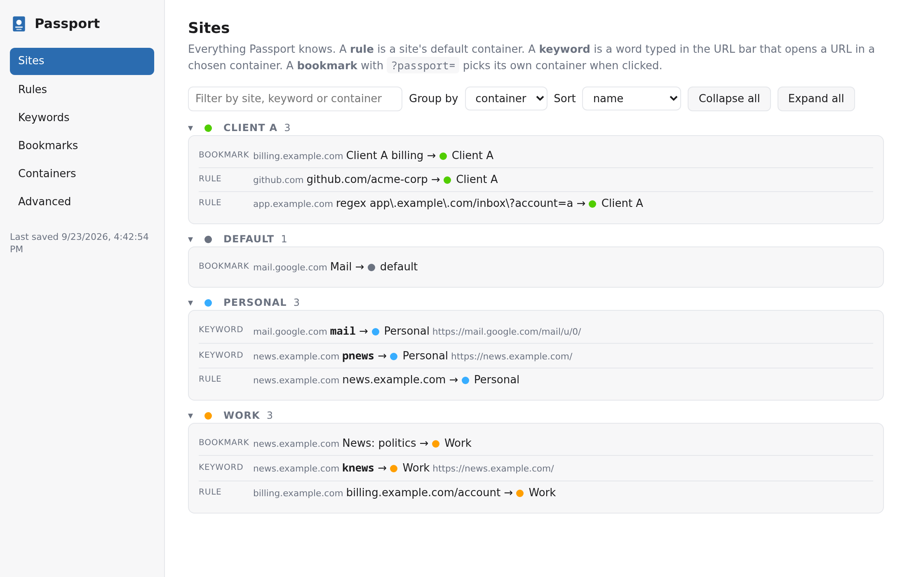
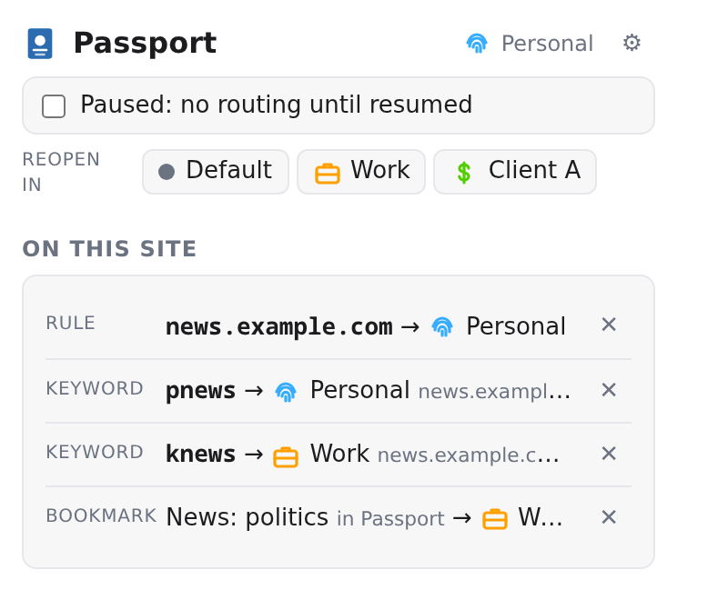
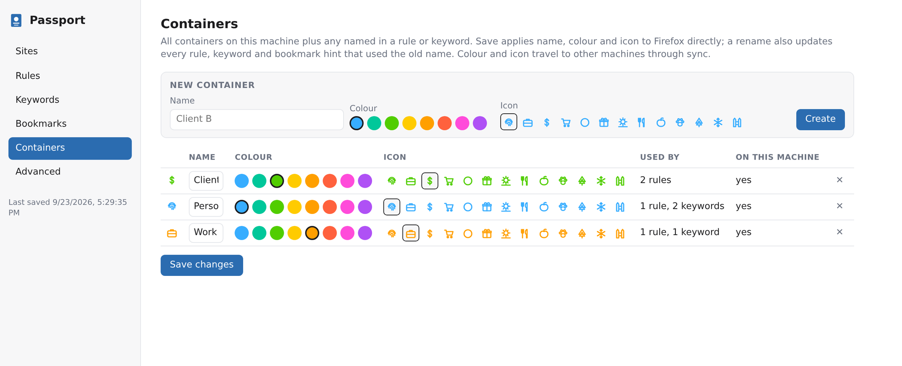

<p align="center">
  
</p>

<h1 align="center">Passport Containers</h1>

<p align="center">
  Per-path container rules for Firefox that follow your Firefox account.<br>
  Plus real Firefox bookmark keywords, set straight from the toolbar.
</p>

<p align="center">
  <a href="https://addons.mozilla.org/firefox/addon/passport-containers/"></a>
  <a href="https://addons.mozilla.org/firefox/addon/passport-containers/"></a>
  <a href="https://addons.mozilla.org/firefox/addon/passport-containers/reviews/"></a>
  <a href="https://github.com/hrolgar/passport-containers/actions/workflows/ci.yml"></a>
  <a href="LICENSE"></a>
</p>

<p align="center">
  <a href="https://addons.mozilla.org/firefox/addon/passport-containers/"></a>
</p>

<p align="center">
  
</p>

## Why

Multi-Account Containers maps a whole domain to one container. Containerise can do per-path
rules, but they never leave the machine you typed them on. I wanted `github.com/acme-corp` in
Work and the rest of GitHub in Personal, on every machine, without setting it up again each
time.

Passport keeps the rules in `storage.sync`, which Firefox Sync carries with your account. Sign
in on a new machine, install Passport, and the containers your rules name are created and the
rules are already there. Containers nothing refers to are left alone, and deleting one in
Firefox sticks. Runs in Firefox and Zen.

## What it does

- **Per-path rules.** Host and path, a glob, or a regex over the full URL. The most specific rule wins.
- **Synced everywhere.** Rules, container colours and icons ride your Firefox account.
- **Real Firefox keywords.** Sign in with your Mozilla account (optional) and a keyword typed in the popup becomes a native bookmark keyword on every device.
- **One-click setup from the popup.** Rule, bookmark and keyword for the current site in one go.
- **Several containers per site.** `?passport=Work` on a bookmark URL picks the container; the parameter is stripped before the site sees it.
- **Reopen and pause.** Move a tab to another container, or stop all routing until you resume.
- **Problems view, backup and restore.** Duplicate rules, broken regex and missing containers are flagged; everything exports to one JSON file.

<p align="center">
  
  &nbsp;
  
</p>

## Rules

One per line, `pattern , Container`. Edit them on the settings page or add one from the popup.

```
github.com/acme-corp , Work                plain: host + path, segment boundaries
@app\.example\.com/\?account=2 , Client A  @ = regex on the full URL (sees the query)
!*.internal.example/* , Work               ! = glob on host + path
# comment
```

`mail.google.com , Personal` and `mail.google.com/mail/u/1 , Work` can live side by side in
any order, since the longer pattern wins. A plain rule never matches on a query string, use `@`
for that. The container name `Default` forces the plain uncontained profile.

## Keywords

Firefox has no extension API for bookmark keywords, so Passport has two ways of doing it.

**With a Mozilla account** (Settings, Mozilla account). You sign in on accounts.firefox.com with
the standard OAuth flow (PKCE and a `keys_jwk` scoped key). Passport never sees your password,
and the Sync key stays in local extension storage on that machine. A keyword typed in the popup
is written into the bookmark's Firefox Sync record, and Firefox applies it as a native keyword
on the next sync, which Passport triggers within seconds by editing a helper bookmark called
"Passport sync". You get the address bar's top "Visit" suggestion, on every device. The code is
in [`src/sync/`](src/sync).

**Without an account.** A bare word in the URL bar turns into a search on your default engine.
Passport catches that request before it loads when the word is one of your keywords and opens
the page in its container. Works with Google, Bing, DuckDuckGo, Startpage, Ecosia, Brave,
Qwant, Yahoo, Yandex and Kagi. `go mail` works too.

Put `%s` in a keyword's URL and whatever follows the keyword fills it in: `kgh my-repo` with
`https://github.com/acme/%s`. A keyword without `%s` ignores extra words and lets the search
happen, so `pnews weather` is still a search.

## Shortcuts

| Keys | Action |
| --- | --- |
| `Ctrl+Alt+P` | Open the popup |
| `Ctrl+Alt+Right` / `Ctrl+Alt+Left` | Reopen the tab in the next / previous container |

Rebind them in about:addons, gear menu, Manage Extension Shortcuts. The pause switch is also in
the toolbar icon's right-click menu and shows an "II" badge while paused.

## How it routes

A blocking `webRequest` listener looks at top-level navigations. If the tab is already in the
right container nothing happens. Otherwise the request is cancelled and the URL reopens in a
new tab in the right container, next to the old one. A fresh tab (about:blank, newtab) is
closed, a tab that was already on a page is left where it was. Keyword launches skip the rules,
so a rule for that site does not pull them back.

## Privacy

Passport collects nothing and has no server. The only network calls go to Mozilla's account
and Sync services, and only if you choose to sign in.

## Develop

```sh
git clone https://github.com/hrolgar/passport-containers && cd passport-containers
npm install
npm test          # node --test
npm run lint      # web-ext lint
npm run build     # dist/*.zip
npm run run       # web-ext run, throwaway profile
```

To try it in your real profile: about:debugging, This Firefox, Load Temporary Add-on, pick
`src/manifest.json`. It runs against your real containers, bookmarks and sync storage. Press
Reload there after an edit. Temporary add-ons are gone when Firefox exits.

## Release

Pushes to `main` run tests, lint and a build, nothing else. Every upload to addons.mozilla.org
restarts the human review, so publishing is always explicit: bump `version` in
`src/manifest.json` and `package.json`, push, then push a matching tag
(`git tag v0.6.0 && git push origin v0.6.0`) or press "Run workflow" on the CI action. That
submits to AMO's listed channel, tags if needed, and creates a GitHub release. AMO never takes a
version number it has seen before, deleted ones included.

## License

[MIT](LICENSE)
